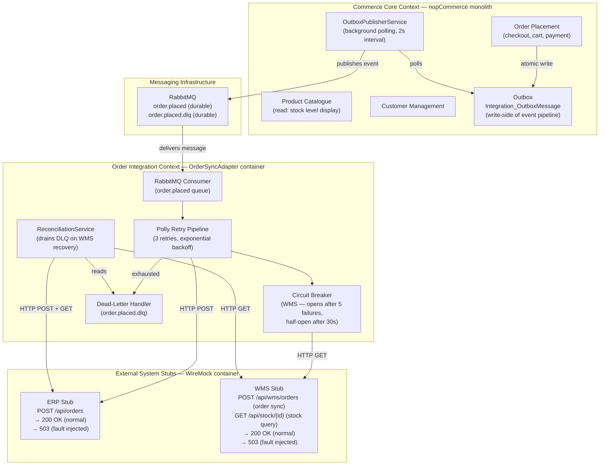

# Bounded-context view (updated — Part 2)

**Author:** Guilherme Silva | Architect  
**Original diagram:** Francisco (Part 1) — [Domain Model & Bounded Contexts.jpg](Domain%20Model%20%26%20Bounded%20Contexts.jpg)  
**Last updated:** 2026-05-18  
**Note:** This document reflects the implemented architecture as of Part 2. The original JPG remains for reference; the diagram below captures any deviations from the planned design.

---

## Context map

---

## Context relationships

| Upstream | Downstream | Relationship | Interface |
|---|---|---|---|
| Commerce Core | Order Integration | Published Language — `order.placed` message schema is the explicit contract | RabbitMQ queue `order.placed` |
| Order Integration | ERP (WireMock) | Conformist — we call ERP's API as-is, no anti-corruption layer | `POST /api/orders` |
| Order Integration | WMS (WireMock) | Conformist + ACL — circuit breaker protects the integration context from WMS instability | `POST /api/wms/orders` |
| WMS (external) | Commerce Core | Published Language — WMS pushes stock events via RabbitMQ; `WmsStockSyncService` consumes and applies deltas | RabbitMQ queue `wms.stock.update` |
| Commerce Core | WMS (WireMock) | Read-only stock query for display | `GET /api/stock/{id}` (via `wms-stock-query.json`) |

---

## What changed relative to Part 1

| Area | Planned (Part 1) | Implemented (Part 2) | Deviation |
|---|---|---|---|
| Outbox location | Inside nopCommerce plugin | Inside nopCommerce plugin | None |
| OrderSyncAdapter | Separate .NET Worker Service | Separate .NET Worker Service | None |
| ERP integration | WireMock stub | WireMock stub | None |
| WMS integration (outbound) | WireMock stub (stock query) | WireMock stub (`POST /api/wms/orders` + `GET /api/stock/{id}` + fault injection) | Extended: order sync endpoint + fault profiles added |
| WMS integration (inbound) | Not planned | `WmsStockSyncService` consuming `wms.stock.update` via RabbitMQ | Added by Carolina — implements QAS-4 |
| Bounded context boundary | nopCommerce DB boundary enforced | `OrderSyncAdapter` has zero Nop.* references | As planned |

The implementation matched the planned design. The only extension was adding fault profiles to the WireMock stubs, which was always part of the Part 2 scope.

---

## Boundary enforcement

`OrderSyncAdapter` has no `<ProjectReference>` to any `Nop.*` library and no connection string to the nopCommerce MSSQL database. The only coupling is the `order.placed` queue schema — a versioned, explicit contract. No shared database across service boundaries.
