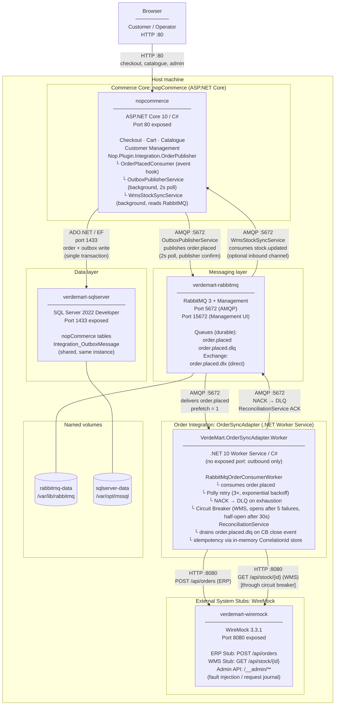

# Container Diagram (C4 Level 3)

**Author:** Carolina Reis | Technical Lead  
**Scenario:** Scenario C - Omnichannel Commerce Core  
**Last updated:** 2026-06-02

This diagram shows all runtime containers, their technology, exposed ports, persistent volumes, and communication paths. It bridges the logical bounded-context view and the actual `infrastructure/docker-compose.yml`.

---

## Diagram

---

## Container inventory

| Container | Image / Runtime | Port(s) | Volume | Role |
|---|---|---|---|---|
| `nopcommerce` | ASP.NET Core 10 (Dockerfile) | 80 | — | Commerce core + Outbox plugin + stock sync |
| `verdemart-sqlserver` | SQL Server 2022 Developer | 1433 | `sqlserver-data` | Persistent store for orders + outbox |
| `verdemart-rabbitmq` | RabbitMQ 3 + Management | 5672, 15672 | `rabbitmq-data` | Message broker: main queue + DLQ |
| `VerdeMart.OrderSyncAdapter.Worker` | .NET 10 Worker (local run) | — | — | Async integration layer to ERP + WMS |
| `verdemart-wiremock` | WireMock 3.3.1 | 8080 | `./wiremock/mappings` | ERP + WMS stubs; fault injection |

> Note: `VerdeMart.OrderSyncAdapter.Worker` is run locally (`dotnet run`) during development. In a production deployment it would be packaged as a container alongside the others.

---

## Key design decisions visible in this diagram

- **No direct checkout → ERP/WMS path.** The only connection from the Commerce Core to external systems goes through the Outbox → RabbitMQ → OrderSyncAdapter chain. Checkout latency and availability are fully decoupled from ERP/WMS state.
- **Single SQL Server instance, shared by Outbox.** The Outbox table lives in the same database as the nopCommerce order tables, which is what makes the atomic write (order + outbox in one transaction) possible without distributed coordination.
- **OrderSyncAdapter has no inbound port.** It is a pure consumer. External systems cannot call it directly; they respond only to requests it initiates.
- **WireMock serves both stubs on one port.** ERP and WMS are distinguished by path (`/api/orders` vs `/api/stock/*`), not by port. The Admin API (`/__admin/**`) on the same port is used for fault injection and request journal queries during testing.
