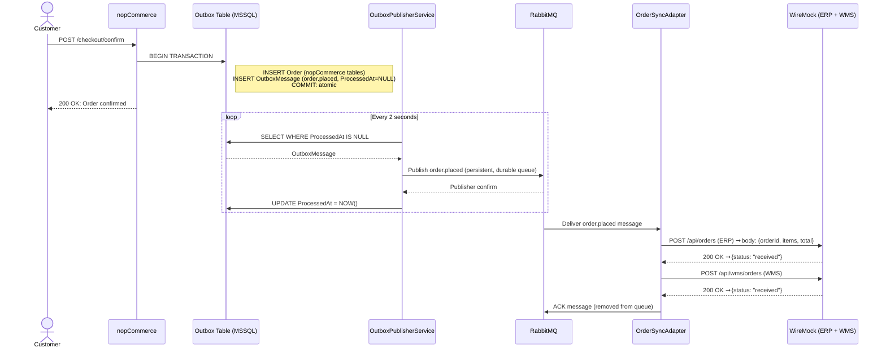
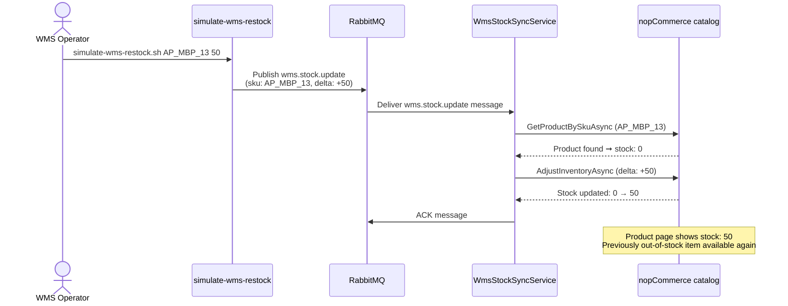
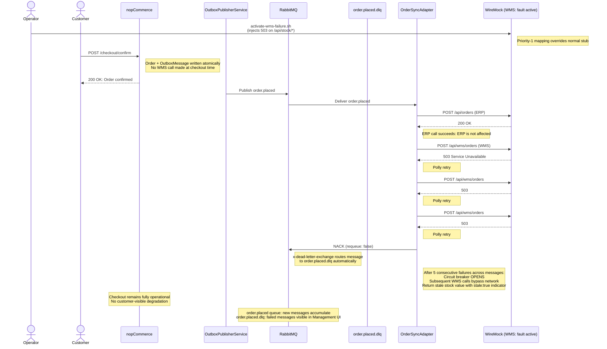
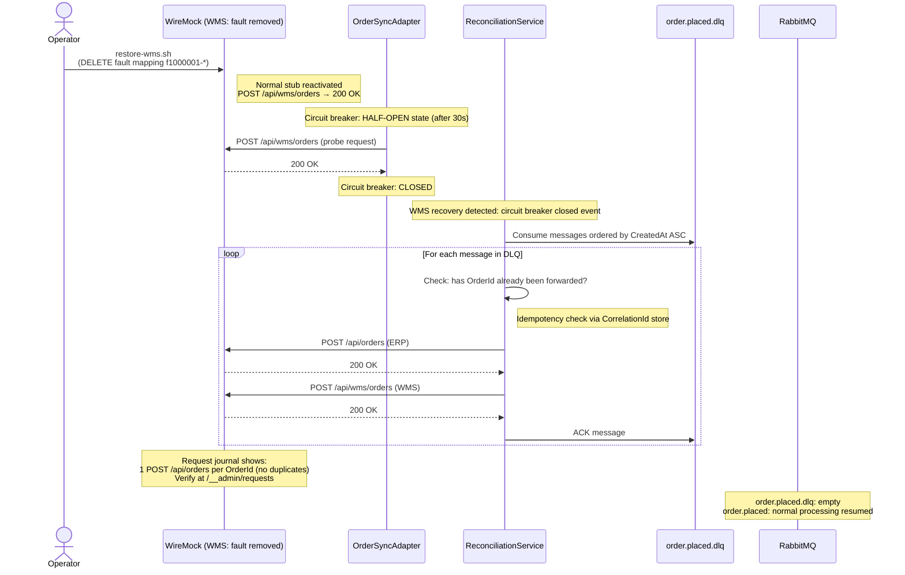

# Runtime interaction diagrams

**Author:** Guilherme Silva | Architect  
**Scenario:** Scenario C — Omnichannel Commerce Core  
**Last updated:** 2026-06-02

The four diagrams below document the observable runtime behaviour during normal operation, cross-channel stock sync, WMS degradation, and automatic recovery.

---

## Diagram 1 — Normal flow

The checkout never calls ERP or WMS directly. The Outbox write is atomic with the order write, so there is no window where an order exists without a corresponding event. OrderSyncAdapter is the only component that crosses the integration boundary outbound — it calls both ERP (`POST /api/orders`) and WMS (`POST /api/wms/orders`) for every order.

  

---

## Diagram 2 — Stock sync flow (WMS to nopCommerce)

The reverse flow: a WMS stock event propagates back into nopCommerce without any operator action.

`WmsStockSyncService` runs inside the nopCommerce plugin. It resolves the product by SKU and applies the delta via `AdjustInventoryAsync`, which records a proper stock history entry.

  

---

## Diagram 3 — Degraded flow (WMS unavailable)

Checkout success is 100% regardless of WMS state (QAS-1). Polly retries absorb transient failures before a message moves to the DLQ. After 5 consecutive failures across messages, the circuit breaker opens and WMS calls skip the network, returning a stale cached value. Messages are not lost — the DLQ is durable and visible in the RabbitMQ Management UI.

  

---

## Diagram 4 — Recovery flow

Recovery is fully automatic once the fault is removed (QAS-3). ReconciliationService processes messages in creation order and checks each OrderId before forwarding, so duplicate ERP calls are not possible even if a message was partially processed during the outage. The WireMock request journal at `/__admin/requests` shows exactly one `POST /api/orders` per OrderId — use this to verify idempotency during the demo.

  

