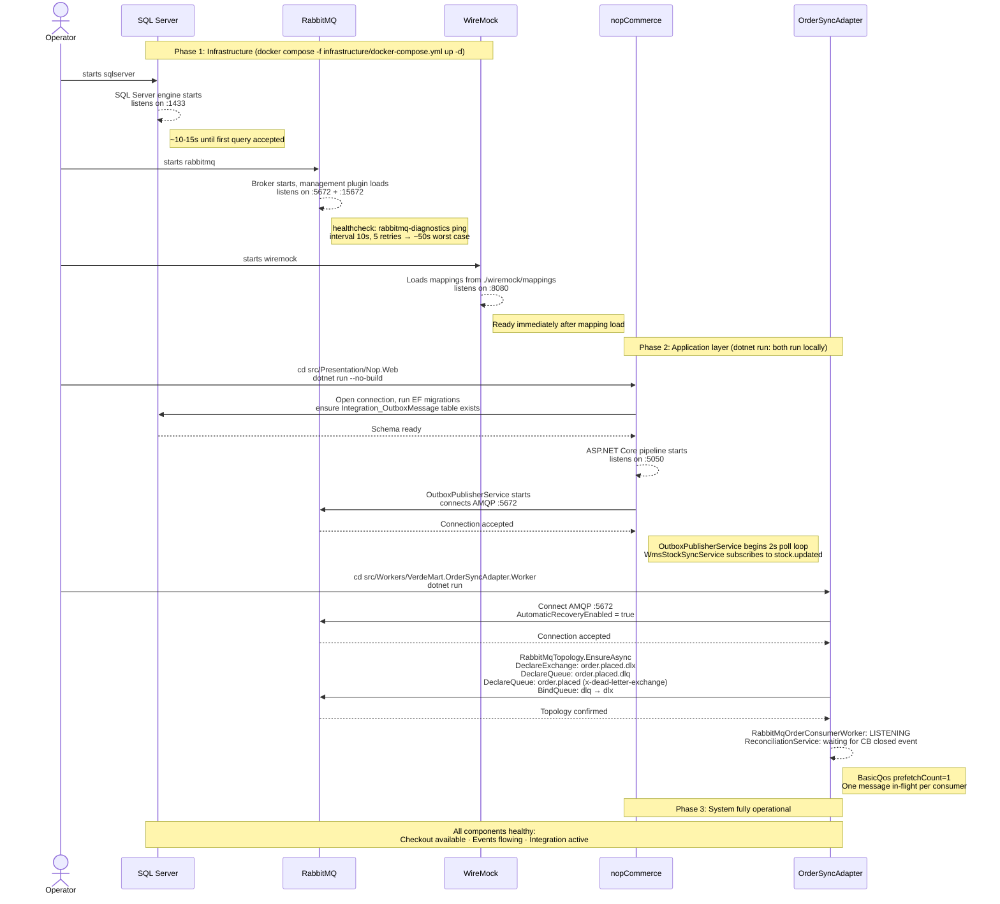

# Startup Sequence Diagram

**Author:** Carolina Reis | Technical Lead  
**Scenario:** Scenario C - Omnichannel Commerce Core  
**Last updated:** 2026-06-02

This diagram shows the initialization order of all containers and components, what each one waits for before it becomes operational, and the consequence of starting out of order.

---

## Diagram



<div style="background-color: white; padding: 8px; display: inline-block;">
  
</div>

---

## Startup dependencies

| Component | Start command | Hard dependency | Consequence if missing |
|---|---|---|---|
| `nopCommerce` | `dotnet run --no-build` (Nop.Web) | SQL Server `:1433` reachable | ASP.NET startup fails: EF migration cannot run |
| `nopCommerce` | — | RabbitMQ `:5672` (soft) | App starts, but `OutboxPublisherService` retries connection; no events published until RabbitMQ is up |
| `OrderSyncAdapter` | `dotnet run` (Worker) | RabbitMQ `:5672` | Worker exits: `CreateConnectionAsync` throws; must be restarted manually |
| `OrderSyncAdapter` | — | WireMock `:8080` | Worker starts; first sync attempt fails → Polly retries → DLQ. WireMock can be started after without data loss |
| `OrderSyncAdapter` | — | SQL Server | No dependency: the Worker has no database connection |

---

## Safe startup order

```
1. docker compose -f infrastructure/docker-compose.yml up -d
   (starts sqlserver, rabbitmq, wiremock: wait ~50s for rabbitmq healthcheck)
2. cd src/Presentation/Nop.Web && dotnet run --no-build
   (wait for SQL Server :1433 to be ready; RabbitMQ already up)
3. cd src/Workers/VerdeMart.OrderSyncAdapter.Worker && dotnet run
   (RabbitMQ must be healthy first)
```

Steps 1–3 reflect the actual local dev workflow: infrastructure runs in Docker, nopCommerce and OrderSyncAdapter run as local `dotnet run` processes.

---

## Recovery after component restart

| Restarted component | Effect | Automatic recovery |
|---|---|---|
| SQL Server | nopCommerce loses DB connection; checkout fails until reconnect | EF connection resilience retries on next request |
| RabbitMQ | Both `OutboxPublisherService` and `OrderSyncAdapter` lose AMQP connection | `AutomaticRecoveryEnabled = true` on both sides: reconnects and re-declares topology automatically |
| WireMock | In-flight HTTP calls to ERP/WMS fail; Polly retries absorb transient gap | When WireMock is back, Polly succeeds; DLQ messages are reconciled on next CB close |
| OrderSyncAdapter | No messages lost: `order.placed` queue is durable; messages accumulate | Restart Worker; `ReconciliationService` drains DLQ on startup if CB is already closed |
| nopCommerce | Checkout unavailable; Outbox poller stops; no new events published | Re-run `dotnet run --no-build`; Outbox resumes from last unprocessed row (`ProcessedAt IS NULL`) |
