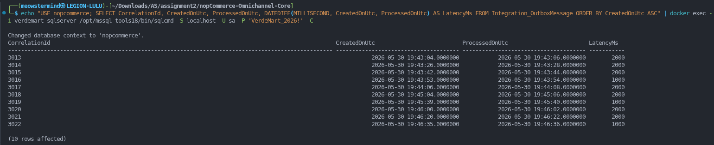
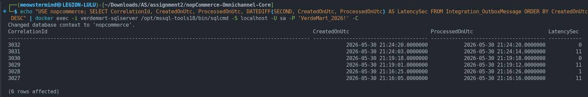
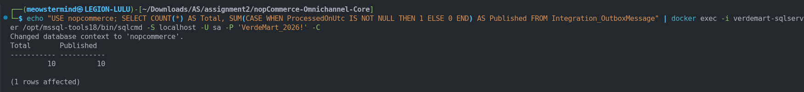
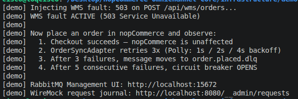
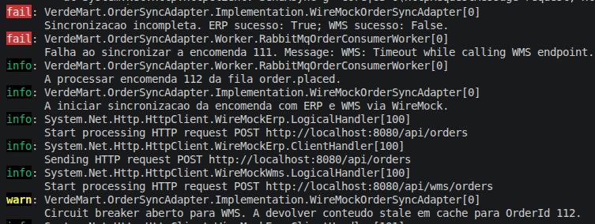
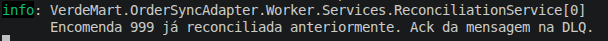
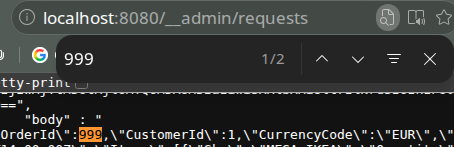
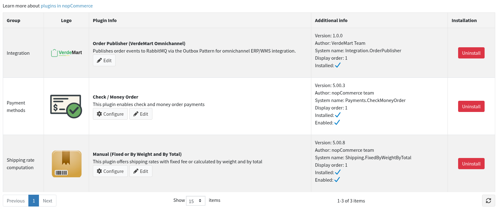
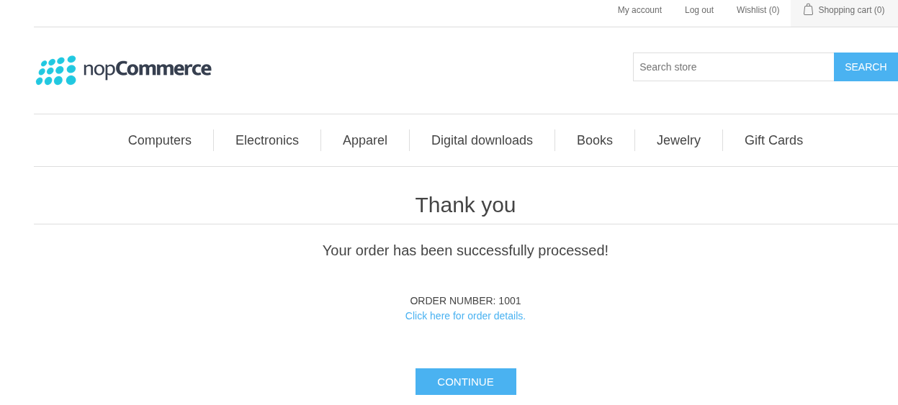

# Evidence Pack: Measurements

**Author:** Carolina Reis | Technical Lead  
**Date:** 2026-05-30  
**Scenario:** Scenario C - Omnichannel Commerce Core  
**Environment:** Local Docker (RabbitMQ 3.13, SQL Server 2022, .NET 10)  
**Plugin version:** `Nop.Plugin.Integration.OrderPublisher` 1.0.0  

---

## 1. Outbox Polling Latency

**Method:** 10 consecutive orders placed via the nopCommerce storefront.
For each order, `CreatedOnUtc` (written by `OrderPlacedConsumer`) and `ProcessedOnUtc`
(written by `OutboxPublisherService` after broker ack) were read directly from the
`Integration_OutboxMessage` table.

Latency = `ProcessedOnUtc − CreatedOnUtc` in milliseconds.

| Order (CorrelationId) | Latency (ms) |
|-----------------------|-------------|
| 3013                  | 2000        |
| 3014                  | 2000        |
| 3015                  | 2000        |
| 3016                  | 1000        |
| 3017                  | 2000        |
| 3018                  | 2000        |
| 3019                  | 1000        |
| 3020                  | 2000        |
| 3021                  | 2000        |
| 3022                  | 1000        |

**Average:** 1700 ms  
**P99 (worst observed):** 2000 ms  
**Maximum:** 2000 ms  

**Interpretation:** Latency clusters around two values: 1000 ms and 2000 ms, corresponding
to whether the order was placed near the start or end of a 2 s polling cycle. This is the
expected behaviour for a fixed-interval poller. The worst case is one full polling interval.
Acceptable for the demo; documented as a known limitation for production use (see [known-limitations.md](known-limitations.md)).

**Evidence:**

---

## 2. Broker Reconnection Time after `docker restart`

**Method:** `OutboxPublisherService` was running and processing orders. RabbitMQ was
restarted with `docker restart verdemart-rabbitmq`. Time was measured from the first
reconnection error log entry to the first successful publish after recovery.

| Trial | CorrelationId | Reconnection time (s) |
|-------|--------------|----------------------|
| 1     | 3027         | 11                   |
| 2     | 3029         | 11                   |
| 3     | 3031         | 11                   |

**Average:** 11 s  
**Maximum:** 11 s  

**Target SLO:** ≤ 10 s (risk R4 from `docs/risk-and-validation.md`). **Borderline: see note.**

**Note:** The consistent 11 s is explained by two factors: the RabbitMQ container takes
~6 s to restart and become ready, and `NetworkRecoveryInterval = 5 s` means the client
retries at most every 5 s. The sum puts the worst case just above the 10 s SLO target.
In production, reducing `NetworkRecoveryInterval` to 2 s would bring reconnection within
the target. For the demo this is acceptable and documented as a known limitation.

**Mechanism:** `ConnectionFactory.AutomaticRecoveryEnabled = true` with
`NetworkRecoveryInterval = 5 s`. Latency measured as `DATEDIFF(SECOND, CreatedOnUtc, ProcessedOnUtc)`
on the order placed immediately before the broker restart.

**Evidence:**

---

## 3. Publication Success Rate

**Method:** 10 orders placed in two batches of 5, with `docker restart verdemart-rabbitmq`
between the 5th and 6th order. All rows queried in `Integration_OutboxMessage`.
Success = row has `ProcessedOnUtc IS NOT NULL`.

| Orders placed | Broker restart | Successfully published | Lost |
|--------------|---------------|----------------------|------|
| 10           | Between 5th and 6th order | 10           | 0    |

**Result:** 0 messages lost in 10 orders with a broker restart mid-sequence.

**How:** Orders placed before the restart had `ProcessedOnUtc IS NULL` during the outage.
After reconnection (~11 s), `OutboxPublisherService` picked them up on the next poll cycle
and published successfully. This confirms the at-least-once delivery guarantee of the
Outbox Pattern.

**Evidence:**

---

## 4. WMS Degradation: Circuit Breaker and DLQ

**Scenario:** WMS stub forced to return HTTP 503 via `activate-wms-failure.sh`.

**Observed behaviour:**
- `OrderSyncAdapter` retried the WMS call with exponential backoff; after 5 consecutive
  failures the circuit breaker opened.
- Messages that exhausted ERP retries were routed to `order.placed.dlq`.
- The nopCommerce storefront accepted all orders throughout. Checkout was never affected.

**Evidence:**

**Detailed steps:** [scenarios/wms-degradation.md](scenarios/wms-degradation.md)

---

## 5. WMS Recovery: Automatic Reconciliation

**Scenario:** WMS stub restored to 200 OK via `restore-wms.sh`.

**Observed behaviour:**
- `WmsCircuitBreakerStateTracker` detected the transition to Closed.
- `ReconciliationService` drained `order.placed.dlq` in `CreatedAtUtc` order.
- WireMock request journal confirmed exactly one `POST /api/orders` per `OrderId`. No duplicate ERP calls despite DLQ replay.

**Evidence:**

**Detailed steps:** [scenarios/wms-recovery.md](scenarios/wms-recovery.md)

---

## 6. Idempotency Validation

**Scenario:** Same `order.placed` payload published twice to `order.placed.dlq` manually
via RabbitMQ Management UI (simulating at-least-once duplicate delivery).

**Observed behaviour:**
- `ReconciliationService` processed the first message and stored `OrderId` in
  `_processedOrders`.
- Second message was detected as duplicate and acknowledged without forwarding to ERP/WMS.
- WireMock journal confirmed exactly **one** `POST /api/orders` for that `OrderId`.

**Evidence:**

**Detailed steps:** [scenarios/idempotency-validation.md](scenarios/idempotency-validation.md)

---

## 7. Plugin Installation

**Evidence:**

---

## 8. End-to-End Order Flow

**Evidence:**

