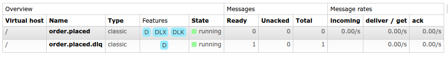
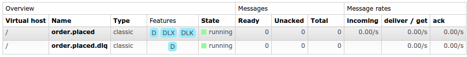

# Scenario 2: WMS Recovery and Automatic Reconciliation

## Objective
Demonstrate how the system restores consistency once the WMS recovers from the simulated failure, showing that the reconciliation service drains retained messages from the DLQ after the circuit breaker closes.

## Execution Steps and Evidence

1. **Deactivate Failure Stub (Recovery):**
   - In the terminal, executed the recovery script: `./restore-wms.sh`.
   - The WMS (WireMock) became available again, ready to accept HTTP 200 OK requests.

2. **ReconciliationService Action:**
   - The `WmsCircuitBreakerStateTracker` detected the circuit state transition to "Closed".
   - The `ReconciliationService` was already running and started draining `order.placed.dlq` once the circuit closed.
   - Observed the queue being drained in the terminal, ordered by `CreatedAtUtc` and then `OrderId`.

3. **Final Consistency in WireMock:**
   - Accessed the WireMock request journal (`http://localhost:8080/__admin/requests`) to confirm that the HTTP POST requests were successfully received.
   - Verified that each `OrderId` processed from the DLQ resulted in one successful call to the ERP and one successful call to the WMS.
   - The final state across nopCommerce, ERP, and WMS is synchronized.
