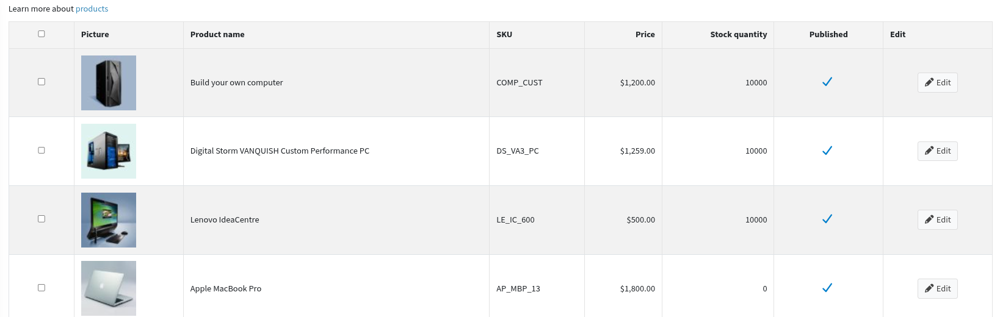
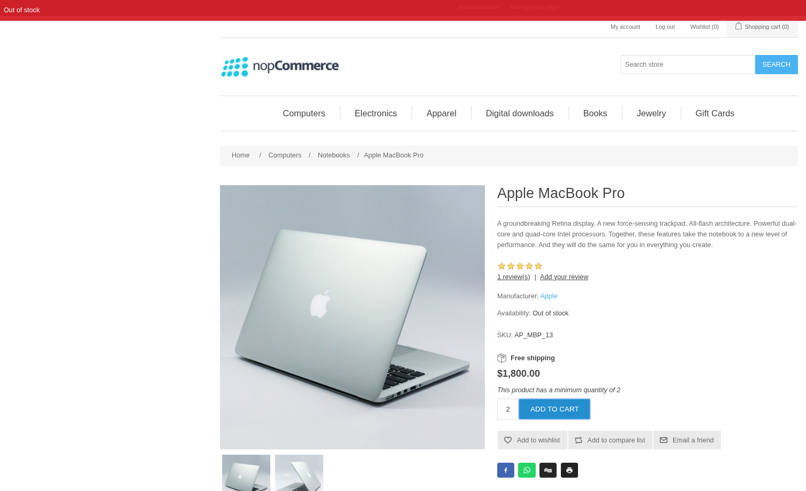
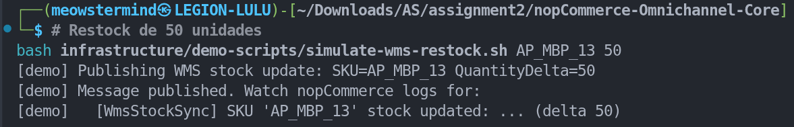
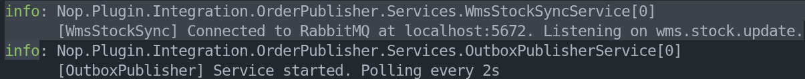
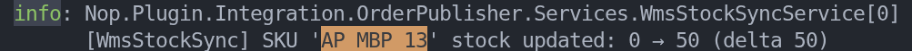
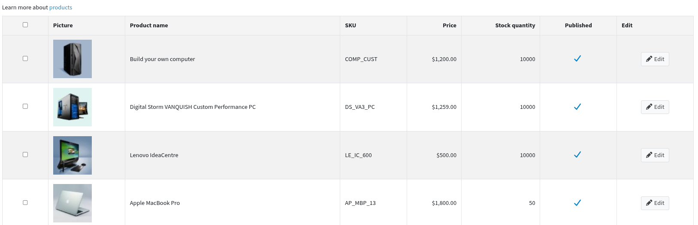

# Scenario 4: Cross-Channel Stock Visibility (WMS → nopCommerce)

## Objective

Demonstrate that stock level changes originating in the WMS are reflected in nopCommerce
automatically without manual intervention, satisfying the cross-channel stock/order-state
visibility use case from Scenario C.

This is the **reverse flow** of the order sync: instead of nopCommerce pushing events to
the WMS, the WMS pushes stock updates back to nopCommerce via the `wms.stock.update` queue.

## Components Involved

| Component | Role |
|---|---|
| `simulate-wms-restock.sh` | Publishes a `wms.stock.update` message simulating a WMS stock event |
| `wms.stock` exchange | RabbitMQ direct exchange receiving WMS stock updates |
| `wms.stock.update` queue | Durable queue consumed by `WmsStockSyncService` |
| `WmsStockSyncService` | nopCommerce plugin background service: applies the delta to the product |
| `IProductService.AdjustInventoryAsync` | nopCommerce native service: updates `StockQuantity` and records history |

## Execution Steps and Evidence

### 1. Initial state: product out of stock

Stock for SKU `AP_MBP_13` was depleted to 0.
The nopCommerce storefront shows the product as unavailable.





---

### 2. WMS restock event: script execution

The WMS restock is simulated by running `simulate-wms-restock.sh`, which publishes a
`{ "Sku": "AP_MBP_13", "QuantityDelta": 50 }` message to the `wms.stock` exchange via
the RabbitMQ Management API.

```bash
bash infrastructure/demo-scripts/simulate-wms-restock.sh AP_MBP_13 50
```



---

### 3. Automatic stock update: nopCommerce logs

`WmsStockSyncService` consumed the message from `wms.stock.update` and called
`IProductService.AdjustInventoryAsync` with `delta = +50`. The nopCommerce logs confirm
the update was applied immediately:





---

### 4. Final state: stock restored

The product stock in the nopCommerce admin reflects the WMS-reported quantity (50 units),
and the storefront shows the product as available again.



---

## Observed Result

| Check | Result |
|---|---|
| Message published to `wms.stock.update` | ✓ |
| `WmsStockSyncService` consumed message | ✓ |
| `AdjustInventoryAsync` called with correct delta | ✓ |
| nopCommerce stock updated without restart | ✓ |
| Storefront reflects new stock level | ✓ |

## Architecture Traceability

- **QAS**: Cross-channel stock/order-state visibility (Scenario C, mandatory use case 2)
- **ADR-001**: Async messaging via RabbitMQ: the `wms.stock` exchange uses the same
  durable messaging infrastructure as `order.placed`
- **Implementation**: `WmsStockSyncService` (plugin) + `simulate-wms-restock.sh` (demo trigger)
